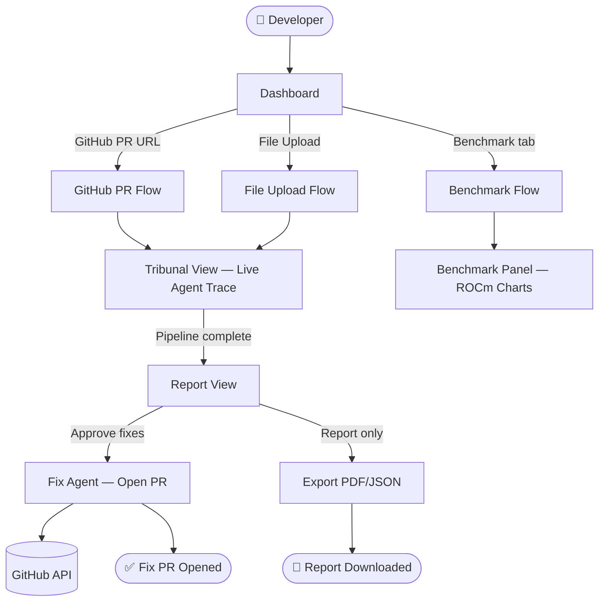
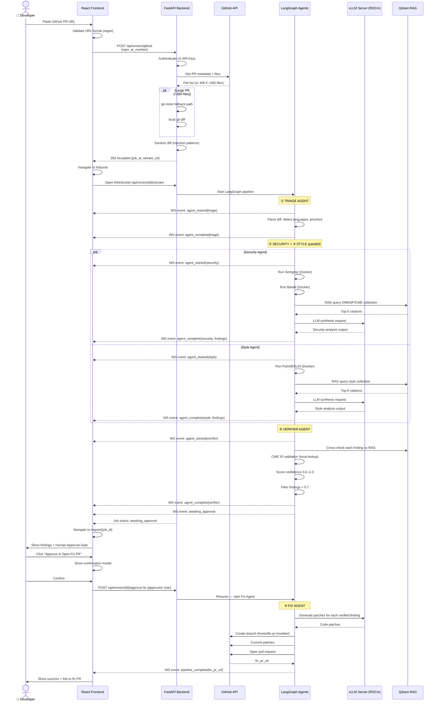
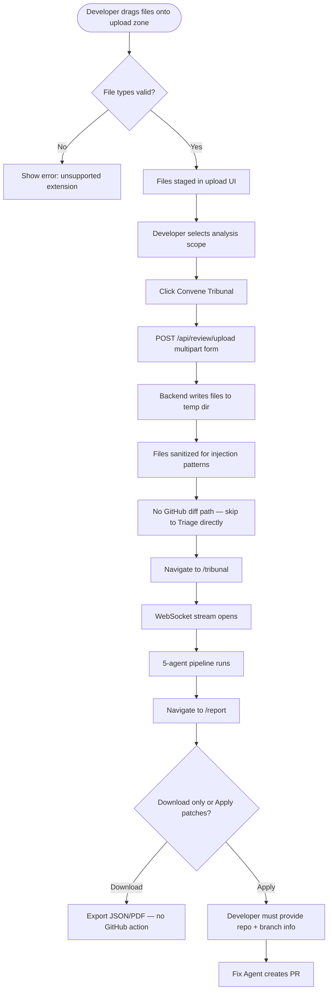
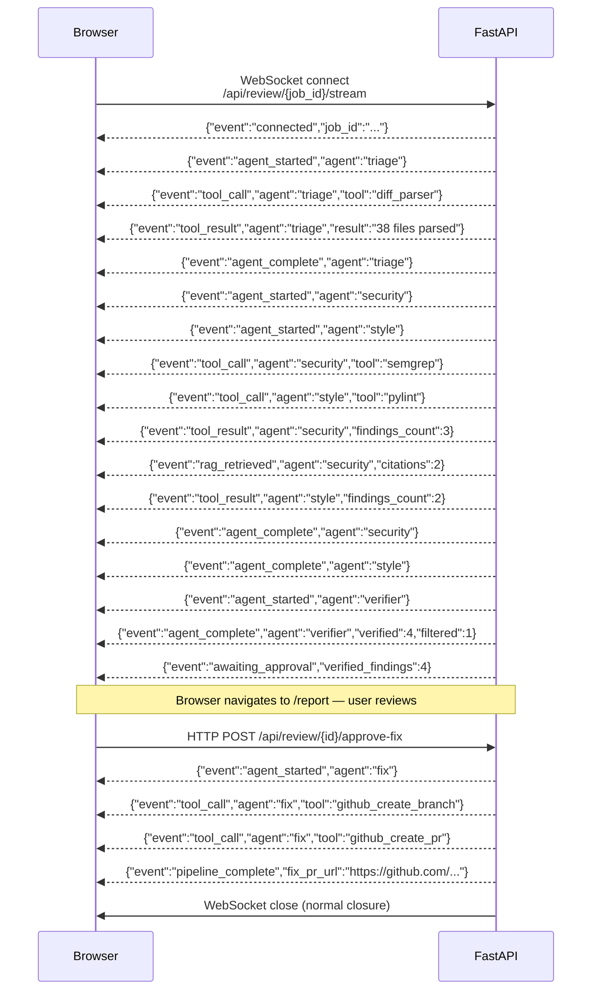
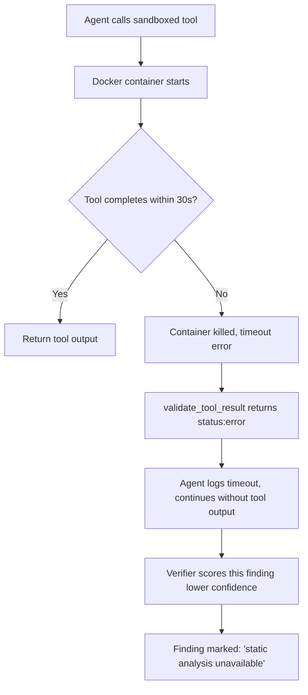
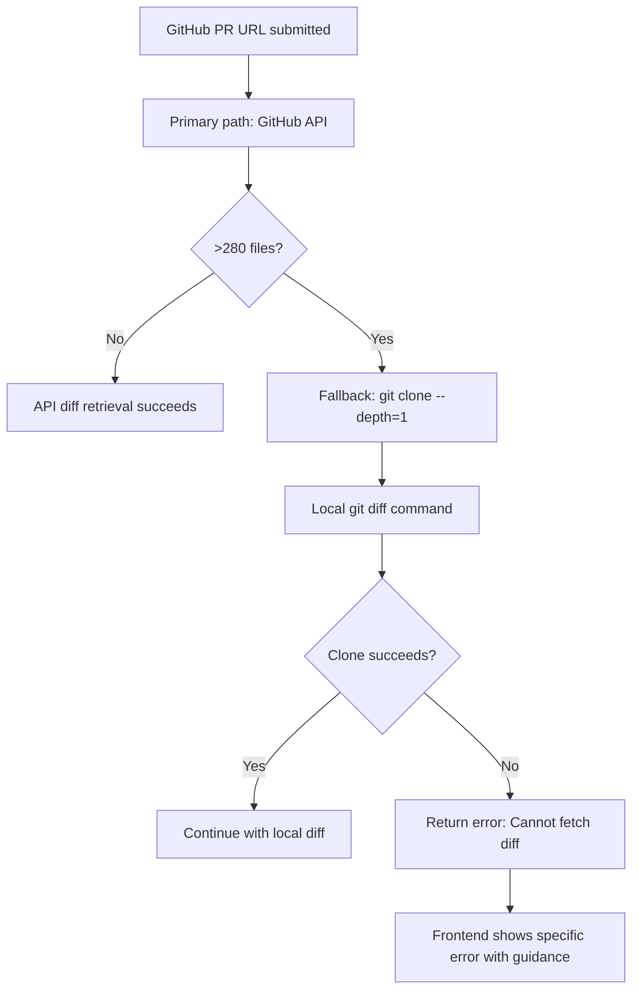
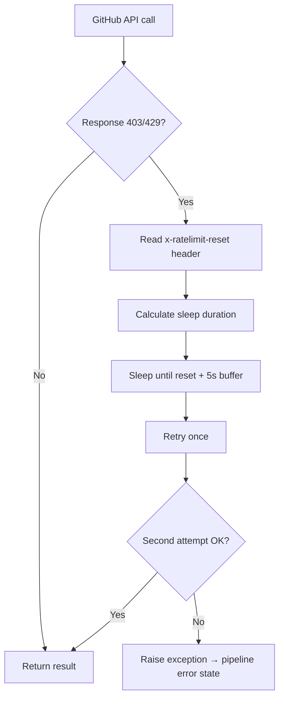
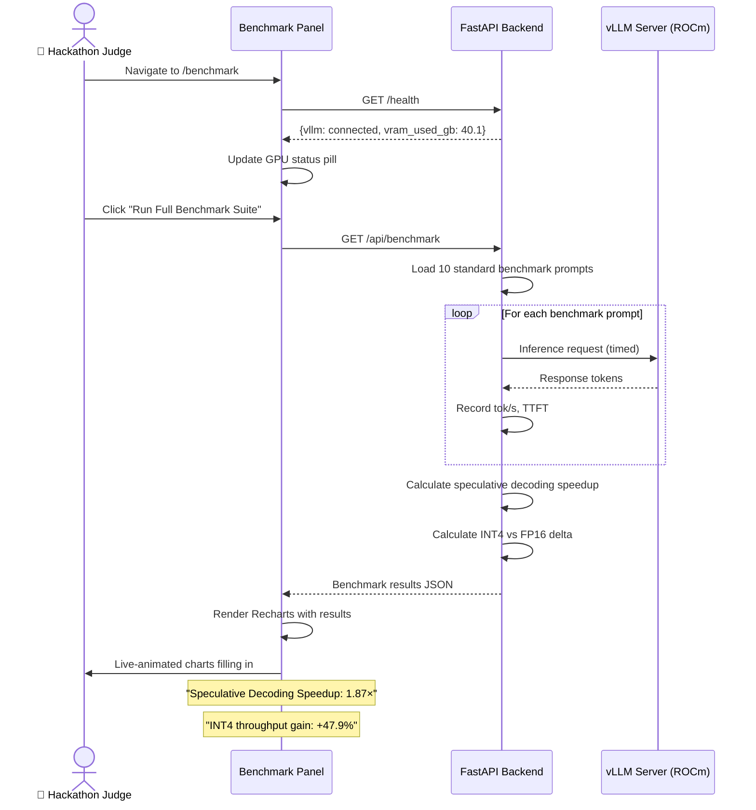
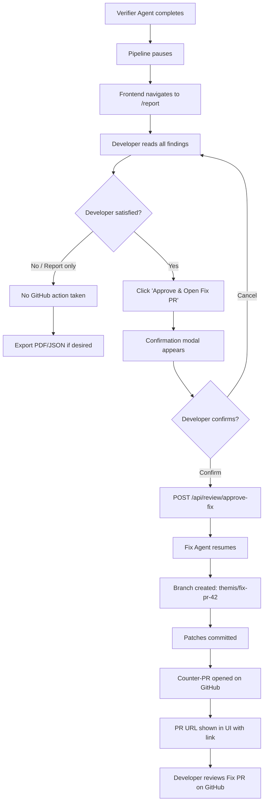

# THEMIS — App Flow Document
## Version 1.0 | AMD AI DevMaster Hackathon | July 20, 2026

---

## 1. High-Level Application Flow



---

## 2. User Journey: GitHub PR Review Flow



---

## 3. User Journey: File Upload Flow



---

## 4. Internal: 5-Agent Pipeline State Machine

```mermaid
stateDiagram-v2
    [*] --> Triage : job submitted

    Triage --> SecurityStyle : triage_complete = true
    Triage --> Error : exception

    state SecurityStyle {
        [*] --> Security
        [*] --> Style
        Security --> [*]
        Style --> [*]
    }

    SecurityStyle --> Verifier : both agents complete (reducer merged findings)
    SecurityStyle --> Error : both agents failed

    Verifier --> AwaitingApproval : verified_findings populated
    Verifier --> ReportOnly : verified_findings empty (no issues found)

    AwaitingApproval --> Fix : fix_approved = true
    AwaitingApproval --> ReportOnly : fix_approved = false (user declines)

    Fix --> Complete : fix_pr_url set
    Fix --> Error : GitHub API failure

    ReportOnly --> Complete
    Complete --> [*]
    Error --> [*]

    note right of Triage
        Loop guard active:
        recursion_limit=30
        SHA-256 tool dedup
    end note

    note right of Verifier
        confidence threshold: 0.7
        CWE ID validation
    end note

    note right of AwaitingApproval
        Human-in-the-loop
        Pause state
        Frontend shows approval gate
    end note
```

---

## 5. WebSocket Event Sequence (Browser → Server)



---

## 6. Error Flows

### vLLM Unavailable

```mermaid
flowchart TD
    A[Request submitted] --> B[Backend calls vLLM health check]
    B --> C{vLLM responding?}
    C -- Yes --> D[Pipeline starts normally]
    C -- No --> E[Return 503 Service Unavailable]
    E --> F[Frontend shows error banner:<br>"GPU inference server is offline.<br>Try again in a moment."]
    F --> G[Frontend shows 'Retry' button]
    G --> H[User retries after 30s]
    H --> B
```

### Docker Sandbox Timeout



### GitHub 406 Large PR



### GitHub Rate Limit Hit



---

## 7. Benchmark Flow



---

## 8. Navigation Flow Summary

```mermaid
flowchart LR
    subgraph "Always Accessible"
        Nav[Top Navigation Bar]
    end

    subgraph "Pages"
        D[/ Dashboard]
        T[/tribunal Tribunal View]
        R[/report/:id Report View]
        B[/benchmark Benchmark]
    end

    Nav --> D
    Nav --> B

    D --> |Submit PR or files| T
    T --> |Pipeline complete| R
    R --> |Back| D
    R --> |Approve fix| R
    B --> D
```

---

## 9. Human-in-the-Loop Detail Flow


